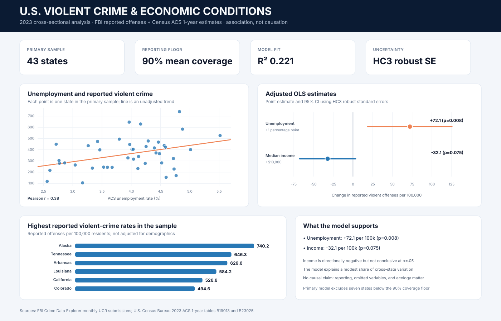

# U.S. Violent Crime & Socioeconomic Conditions

A reproducible 2023 cross-sectional analysis of how state unemployment and median household income are associated with FBI-reported violent-crime rates. The project prioritizes data provenance, reporting-coverage controls, robust inference, and honest limits over causal storytelling.



## Portfolio snapshot

| Evidence | Result |
|---|---:|
| Source geography | 50 states |
| FBI observations validated | 600 state-months |
| Primary model sample | 43 states |
| Minimum mean FBI reporting coverage | 90% |
| Regression specifications tested | 5 |
| Automated tests | 5 |

## What the analysis supports

The primary model is an unweighted state-level OLS regression with HC3 heteroskedasticity-robust standard errors. It controls for both predictors simultaneously.

- A 1 percentage-point higher unemployment rate was associated with **72.1 additional reported violent offenses per 100,000 residents** (95% CI: 18.9 to 125.3; p = 0.0079).
- A $10,000 higher median household income was associated with **32.1 fewer reported violent offenses per 100,000 residents**, but the primary estimate was not conclusive at the 5% level (95% CI: -67.4 to 3.2; p = 0.0746).
- The model explained a modest share of cross-state variation (**R² = 0.221; adjusted R² = 0.183**).
- The unemployment result remained positive across all five documented specifications. Income remained negative, but its statistical strength changed with the reporting-coverage threshold and influence treatment.

These are state-level associations, not estimates of causal effects on individuals or communities.

## Why the workflow is defensible

- Uses **direct state-level ACS estimates** rather than averaging county medians or county unemployment rates.
- Builds the outcome from 12 monthly FBI Crime Data Explorer observations for every state and validates each rate against the participating population.
- Excludes seven states whose mean 2023 FBI population coverage was below 90%: Florida, Indiana, Mississippi, Nebraska, New Mexico, South Dakota, and Wyoming.
- Uses HC3 robust standard errors and publishes residual, heteroskedasticity, multicollinearity, leverage, and Cook's-distance diagnostics.
- Publishes sensitivity checks using all 50 states, a 95% coverage floor, a log outcome, and an influence diagnostic.
- Locks headline README claims to generated outputs with tests.

## Data sources

- [FBI Crime Data Explorer](https://cde.ucr.cjis.gov/LATEST/webapp/) monthly UCR violent-crime submissions. The FBI notes that agencies voluntarily submit UCR data, so reporting coverage is treated as a core quality constraint.
- U.S. Census Bureau 2023 ACS 1-year table [B19013](https://www2.census.gov/programs-surveys/acs/summary_file/2023/table-based-SF/data/1YRData/acsdt1y2023-b19013.dat): median household income in 2023 inflation-adjusted dollars.
- U.S. Census Bureau 2023 ACS 1-year table [B23025](https://www2.census.gov/programs-surveys/acs/summary_file/2023/table-based-SF/data/1YRData/acsdt1y2023-b23025.dat): civilian labor force and unemployment counts.
- U.S. Census Bureau [state reference codes](https://www2.census.gov/geo/docs/reference/state.txt).

Compact source snapshots are committed in [`data/source/`](data/source/). Exact URLs, retrieval time, upstream hashes, artifact hashes, and variable notes are recorded in [`source_manifest.csv`](data/source/source_manifest.csv).

## Reproduce the portfolio results

```bash
python -m venv .venv
source .venv/bin/activate
python -m pip install -e ".[dev]"
python scripts/run_analysis.py
python scripts/render_dashboard.py
pytest
```

The commands above use the committed source snapshots, so the published portfolio result is deterministic. To deliberately refresh the public inputs first, run `python scripts/download_data.py`; FBI historical data can be revised, so review all resulting changes before replacing the snapshot.

## Repository map

```text
config/                 Analysis year and reporting-coverage threshold
data/source/            Compact public-source snapshots and manifest
data/processed/         Validated 50-state analysis dataset
docs/                   Methodology and data dictionary
outputs/figures/        Recruiter-facing SVG dashboard
outputs/tables/         Coefficients, diagnostics, sensitivity, and summaries
scripts/                Download, analysis, and dashboard entry points
src/us_crime_analysis/  Tested acquisition, modeling, and rendering code
tests/                  Source, result, and artifact regression tests
```

See [`docs/methodology.md`](docs/methodology.md) for the full design and limitations and [`docs/data_dictionary.md`](docs/data_dictionary.md) for field definitions.

## Important limitations

This is a small, observational, state-level cross-section. UCR participation is voluntary; the coverage threshold reduces but does not remove reporting bias. ACS estimates have sampling uncertainty. The model omits many plausible confounders, combines heterogeneous places into state averages, and cannot support individual-level or causal conclusions. “Violent crime” follows the FBI aggregate category represented by the selected CDE endpoint.

## License

Code is released under the [MIT License](LICENSE). Source data remain subject to their publishers' terms and definitions.
